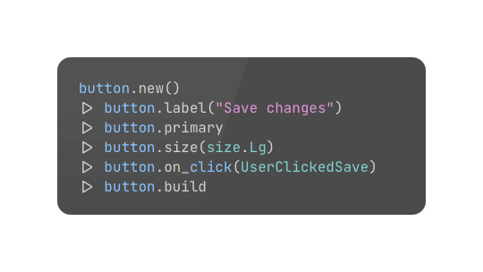

# tidal

[](https://hex.pm/packages/tidal)
[](https://hexdocs.pm/tidal/)

Tidal is a Gleam UI package built on [DaisyUI](https://daisyui.com/), [Tailwind CSS](https://tailwindcss.com/), and [Lustre](https://hexdocs.pm/lustre/). It gives you a complete set of UI components and layout primitives, all written as plain Gleam functions that compose naturally in a pipeline.

---



- **`new()`** — every component starts the same way, no arguments required
- **`label`, `primary`, `size`** — modifiers that configure the component; apply as many as you need, in any order
- **`on_click`** — events are just another modifier, first-class alongside everything else
- **`build`** — produces an `Element(msg)` ready to drop into your Lustre view

---

## What Tidal gives you

- **50+ DaisyUI components** wrapped as typed Gleam builders — buttons, forms, cards, modals, menus, tables, and more
- **Layout primitives** — row, column, grid, stack, container, and other building blocks for structuring your UI
- **A full Tailwind utility layer** via `tidal/styling` — spacing, sizing, typography, colour, responsive breakpoints, and more, all as plain functions
- **Raw Tailwind escape hatch** — every component has `style()` and `attrs()` so you can drop in any Tailwind class or HTML attribute you need
- **35+ built-in themes** from DaisyUI, switchable at runtime with no extra configuration

---

## Requirements

- Gleam >= 1.4
- [Lustre](https://hex.pm/packages/lustre) >= 5.6
- Node.js (for Tailwind and DaisyUI)
- [Lustre Dev Tools](https://hex.pm/packages/lustre_dev_tools) (recommended for development)

---

## Installation

```sh
gleam add tidal
gleam deps download
```

---

## CSS setup

Tidal generates Tailwind class names at runtime inside compiled JavaScript. Tailwind's static scanner can't see them, so the package ships a safelist at `priv/tidal.js` that lists every class any Tidal function can emit. You need one `@source` line in your CSS to point Tailwind at it.

### 1. Install Tailwind and DaisyUI

```sh
npm install tailwindcss @tailwindcss/vite daisyui
```

### 2. Create your CSS entry point

```css
/* src/app.css */
@import "tailwindcss";
@import "../node_modules/daisyui/daisyui.css";

@source "../build/packages/tidal/priv/tidal.js";
```

> The `@source` path is relative to the CSS file's location. If your CSS lives at `src/app.css`, the path above is correct for a standard Gleam project layout. Adjust the `..` segments if your CSS is elsewhere.

> **Why `.js`?** Tailwind v4 only scans file types it recognises as source files. A `.css` file gets parsed as CSS, not scanned for class names. The `.js` extension makes Tailwind extract the class list correctly.

### 3. Vite config

```js
// vite.config.js
import { defineConfig } from "vite";
import tailwindcss from "@tailwindcss/vite";

export default defineConfig({
  plugins: [tailwindcss()],
});
```

### 4. Start developing

```sh
gleam run -m lustre/dev start
```

### Using `s.raw()`

If you reach for `s.raw("my-class")` to pass a class Tidal doesn't have a typed function for, that class won't be in the safelist. Add it with an inline source directive in your CSS:

```css
@source inline("my-class another-class");
```

---

## Theming

DaisyUI themes are activated by setting `data-theme` on the root element:

```html
<html data-theme="dark">
```

Switch themes at runtime by updating the attribute from Gleam:

```gleam
attribute.attribute("data-theme", current_theme)
```

All 35+ built-in DaisyUI themes work without any additional configuration. See the [DaisyUI theme docs](https://daisyui.com/docs/themes/) for the full list.

---

## Components

All components follow the same pipeline: `new()` creates a default, modifier functions configure it, `build` produces an `Element(msg)`.

| Module | Description |
|--------|-------------|
| `tidal/button` | Button with colour variants, sizes, and event handlers |
| `tidal/input` | Text, email, password, number, and other input types |
| `tidal/textarea` | Multi-line text input |
| `tidal/select` | Dropdown select with option list |
| `tidal/toggle` | Toggle switch |
| `tidal/checkbox` | Checkbox |
| `tidal/radio` | Radio button |
| `tidal/slider` | Range slider |
| `tidal/file_input` | File picker |
| `tidal/badge` | Inline badge/tag |
| `tidal/alert` | Alert/notification banner |
| `tidal/avatar` | Avatar with image, placeholder, initials, and status indicator |
| `tidal/tooltip` | Tooltip wrapper |
| `tidal/card` | Card with figure, title, body, and actions slots |
| `tidal/navbar` | Navigation bar with start/center/end slots |
| `tidal/tabs` | Tab bar |
| `tidal/breadcrumb` | Breadcrumb trail |
| `tidal/menu` | Vertical navigation menu |
| `tidal/pagination` | Page number navigation |
| `tidal/dock` | Mobile bottom navigation bar |
| `tidal/modal` | Dialog/modal overlay |
| `tidal/dropdown` | Dropdown menu |
| `tidal/drawer` | Sidebar drawer |
| `tidal/loading` | Loading spinner and variants |
| `tidal/progress` | Progress bar |
| `tidal/radial_progress` | Circular progress indicator |
| `tidal/stat` | Stat display block |
| `tidal/table` | Data table |
| `tidal/collapse` | Collapsible content panel |
| `tidal/chat` | Chat bubble with start/end alignment and colour variants |
| `tidal/rating` | Star/heart rating input |
| `tidal/steps` | Step progress indicator |
| `tidal/timeline` | Vertical or horizontal event timeline |
| `tidal/countdown` | Slot-machine style number display |
| `tidal/diff` | Side-by-side content comparison with draggable divider |
| `tidal/carousel` | Scroll-snap slide container |
| `tidal/toast` | Toast notification stack |
| `tidal/hero` | Full-width hero section with overlay support |
| `tidal/indicator` | Badge/dot overlay on any element |
| `tidal/join` | Join adjacent elements into a group |
| `tidal/kbd` | Keyboard key display |
| `tidal/skeleton` | Loading skeleton placeholder |
| `tidal/swap` | Swap two elements with animation |
| `tidal/link` | Styled anchor element |
| `tidal/footer` | Site footer with columnar navigation |
| `tidal/fieldset` | Form field grouping with legend and label |
| `tidal/list_display` | Styled list with row borders |
| `tidal/mockup_code` | Terminal/code block mockup |
| `tidal/mockup_phone` | Phone device frame |
| `tidal/mockup_window` | Browser/desktop window frame |
| `tidal/theme_controller` | DaisyUI theme switcher via checkbox or radio |

### Colours

Each component has individual colour functions — no separate variant type to import:

```gleam
import tidal/size

badge.new()
|> badge.label(text: "New")
|> badge.success
|> badge.size(size: size.Sm)
|> badge.build
```

The eight semantic colours available on every component are: `primary`, `secondary`, `accent`, `neutral`, `info`, `success`, `warning`, `error`.

### Events

Interactive components have named event functions — no need to reach for `attrs([event.on_click(...)])`:

```gleam
toggle.new()
|> toggle.primary
|> toggle.on_check(handler: UserToggledDarkMode)
|> toggle.build

select.new()
|> select.options(pairs: [#("us", "United States"), #("gb", "United Kingdom")])
|> select.on_change(handler: UserSelectedCountry)
|> select.build
```

---

## Layout primitives

| Module | Description |
|--------|-------------|
| `tidal/el` | Generic block container (`div`) |
| `tidal/row` | Horizontal flex row |
| `tidal/column` | Vertical flex column |
| `tidal/container` | Centered max-width page container |
| `tidal/grid` | CSS grid container |
| `tidal/stack` | Layered stack of overlapping elements |
| `tidal/text` | Span, paragraph, and heading elements |
| `tidal/image` | Image element |
| `tidal/spacer` | Flex spacer (`flex-1`) |
| `tidal/divider` | Horizontal or vertical divider |

```gleam
import tidal/styling as s

row.new()
|> row.style(styles: [s.items_center(), s.justify_between(), s.px(4)])
|> row.children(elements: [
  text.new("Inbox")
  |> text.style(styles: [s.text_xl(), s.font_semibold()])
  |> text.build,
  spacer.spacer(),
  button.new()
  |> button.label(text: "Compose")
  |> button.primary
  |> button.size(size: size.Sm)
  |> button.on_click(handler: UserClickedCompose)
  |> button.build,
])
|> row.build
```

---

## Style system

All style utilities live in `tidal/styling`. Import it once — typically aliased as `s` — and access the full Tailwind utility surface:

```gleam
import tidal/styling as s

el.new()
|> el.style(styles: [
  s.flex(),
  s.flex_col(),
  s.md(s.flex_row()),
  s.p(4),
  s.md(s.p(8)),
  s.gap(4),
])
|> el.build
```

### Responsive styles

Wrap any style value in a breakpoint modifier:

```gleam
el.new()
|> el.style(styles: [
  s.w_full(),
  s.sm(s.max_w_md()),
  s.lg(s.max_w_xl()),
  s.rounded_none(),
  s.sm(s.rounded_xl()),
])
|> el.build
```

### Colours

Use DaisyUI's semantic colour tokens so your UI automatically adapts to the active theme:

```gleam
import tidal/styling as s

text.new("Warning")
|> text.style(styles: [s.text_warning()])
|> text.build

el.new()
|> el.style(styles: [s.bg_base_200()])
|> el.build
```

---

## Examples

The `examples/` directory contains a fully working todo app built with Tidal. To run it:

```sh
cd examples/example_app_todos
gleam deps download
npm install
gleam run -m lustre/dev start
```

---

## Contributing

See [CONTRIBUTING.md](CONTRIBUTING.md).

---

## Licence

Apache 2.0 — see [LICENSE](LICENSE).
